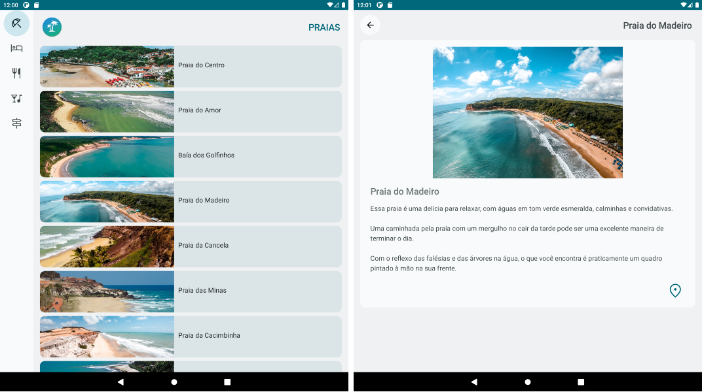
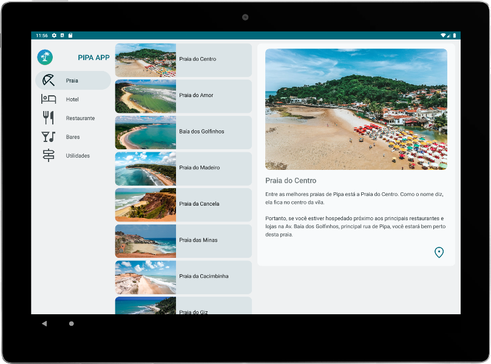

## Table of contents

- [Overview](#overview)
    - [The challenge](#the-challenge)
    - [Screenshot](#screenshot)
- [My process](#my-process)
    - [Built with](#built-with)
    - [What I learned](#what-i-learned)
    - [Continued development](#continued-development)
- [Author](#author)

## Overview

### The challenge

Users should be able to:

- Click on the buttons and navigate between different types of places such as beaches, restaurants, bars and amenities.
- Should be able to access the lists of each menu and click and open the details of the place of interest.
- Click on the location icon and open Google Maps to get directions.
- Being able to browse different screen sizes with better user experience depending on whether it's a smartphone, foldable smartphone or tablet.

### Screenshots

### Links

- Solution URL: [Solution](https://github.com/mlzzi/pipa-beach-app)

## My process

### Built with

- Android Studio
- Kotlin
- Jetpack Compose

### What I learned

In this project, things started to get more complicated because the challenges were increasing the difficulties.
Important concepts such as changing the navigation style depending on the screen size were applied.
I could better understand how the app works, how to use ViewModels, UI State and StateFlow, and how to organize the architecture to build better apps.

### Continued development

I will continue to learn from the Google's platform and from Jetbrain's platform Hyperskill

## Author

- Linkedin - [Murilo Luzzi](https://www.linkedin.com/in/muriloluzzi/)
- GitHub - [@mlzzi](https://github.com/mlzzi)